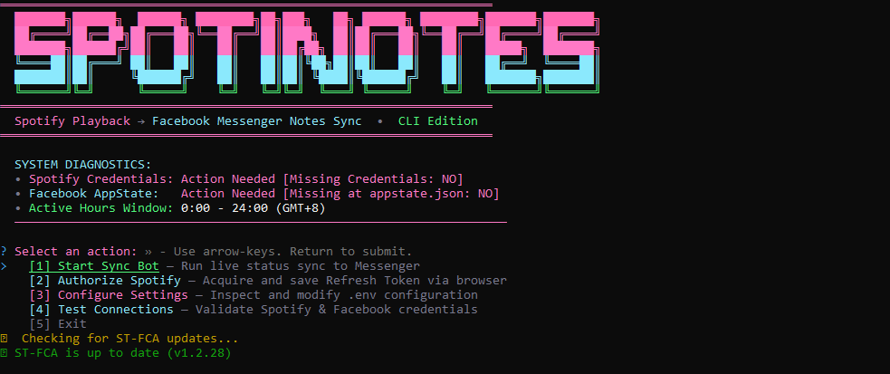

<div align="center">

# SpotiNotes

Automate live Spotify playback status syncing to Facebook Messenger notes in real time through an interactive terminal CLI dashboard.

[](https://www.typescriptlang.org/)
[](https://nodejs.org/)
[](https://developer.spotify.com/)
[](LICENSE)

<br/><br/>



</div>

---

## Overview

Sharing music activity manually across social platforms is repetitive and interrupts listening workflows. While Spotify provides live listening status, Facebook Messenger does not natively connect to third-party streaming services for its personal notes feature.

**SpotiNotes** bridges this gap by querying the Spotify Web API for current playback state and automatically updating Facebook Messenger inbox notes via the Facebook Chat API. The application is packaged as an interactive terminal CLI featuring real-time playback telemetry, countdown timers, keyboard controls, and self-contained OAuth token generation.

> [!] **Note:** Facebook Messenger notes default to "FRIENDS" privacy upon creation and automatically expire after 24 hours if no subsequent tracks are published.

---

## Highlights

| Feature | Description |
| :--- | :--- |
| **Interactive Terminal CLI** | Full-screen terminal dashboard with navigation menus, diagnostics, and keyboard hotkeys. |
| **Live Playback Telemetry** | Displays current song title, artist, track duration, and an animated progress bar. |
| **Integrated Token Generator** | Embedded OAuth callback server on port `8888` that saves refresh tokens to `.env` automatically. |
| **Active Operating Hours** | Configurable operating window to restrict note syncing during sleeping or work hours. |
| **Resilient Networking** | Uncaught exception isolation and automatic connection retries when internet connectivity drops. |
| **Strict TypeScript Architecture** | Typed interfaces, CommonJS compatibility, ambient definitions, and zero inline comment clutter. |

---

## Installation

### Prerequisites
- [Node.js](https://nodejs.org/) (version 18 or higher recommended)
- A Spotify Developer account ([Developer Dashboard](https://developer.spotify.com/dashboard))
- An active Facebook account session cookie export

### Step-by-Step Setup

1. **Clone the repository:**
   ```bash
   git clone https://github.com/Chrixtia/SpotiNotes.git
   cd SpotiNotes
   ```

2. **Install project dependencies:**
   ```bash
   npm install
   ```

3. **Initialize Environment Configuration:**
   Copy the example template to create your `.env` file:
   ```bash
   cp .env.example .env
   ```

4. **Register Spotify Application:**
   - Log into the [Spotify Developer Dashboard](https://developer.spotify.com/dashboard) and create an app.
   - Set the Redirect URI to `http://127.0.0.1:8888/callback`.
   - Copy your **Client ID** and **Client Secret** into `.env`.

5. **Provide Facebook AppState:**
   - Export your Facebook browser session cookies using a cookie manager extension.
   - Save the resulting JSON array as `appstate.json` in the root of the project.

> [!] **Important:** Keep your `appstate.json` and `.env` files strictly private. Never commit them to version control.

---

## Quick Start

### Running the Terminal CLI

To compile TypeScript and immediately open the interactive terminal interface:

```bash
npm run start
```

> [!] **Tip:** You can also run the development server directly without an explicit build step using `npm run dev`.

### CLI Controls & Navigation

When the live sync dashboard is active, control the bot using the following hotkeys:
- **`[S]` or `[Space]`**: Trigger an immediate sync iteration
- **`[P]`**: Pause or resume synchronization
- **`[B]`**: Stop bot and return to the main CLI menu
- **`[Q]` or `[Ctrl+C]`**: Gracefully exit SpotiNotes

---

## Configuration Reference

<details>
<summary><b>Click to expand config options</b></summary>

| Parameter | Type | Default | Description |
| :--- | :--- | :--- | :--- |
| `SpotifyClientID` | `string` | _None_ | Client ID from Spotify Developer Dashboard |
| `SpotifyClientSecret` | `string` | _None_ | Client Secret from Spotify Developer Dashboard |
| `SpotifyRefreshToken` | `string` | _None_ | Long-lived refresh token obtained via CLI authorization |
| `FBStatePath` | `string` | `appstate.json` | Relative or absolute path to Facebook session JSON file |
| `TimezoneGMTOffset` | `number` | `8` | Timezone offset from UTC in hours (e.g. 8 for PHT/SGT) |
| `ActiveHours` | `string` | `0-24` | Allowed operating window formatted as `start-end` (24-hour clock) |
| `MinimumPlayTimeMs` | `number` | `60000` | Minimum track playback progress (ms) before note updates |
| `UpdateIntervalRange` | `string` | `10-12` | Randomized delay window between status checks (in minutes) |

</details>

---

## Automated Tests

Run automated type-checking and build verification:

```bash
npm test
```

---

## Architecture

```text
SpotiNotes/
├── src/
│   ├── index.ts                # Main CLI entry point and bot coordinator
│   ├── get_refresh_token.ts    # Standalone OAuth helper script
│   ├── cli/
│   │   ├── dashboard.ts        # Live terminal dashboard and input handling
│   │   ├── theme.ts            # ANSI color palettes (pink, blue, green) and banner
│   │   └── tokenGenerator.ts   # Interactive Spotify token generator
│   ├── config/
│   │   └── index.ts            # Typed environment configuration and .env writer
│   ├── services/
│   │   ├── messenger.ts        # Facebook Chat API and note mutation service
│   │   └── spotify.ts          # Spotify Web API playback query service
│   ├── types/
│   │   └── stfca.d.ts          # Ambient type definitions for stfca library
│   └── utils/
│       └── index.ts            # Active operating hours calculation utility
├── dist/                       # Compiled production JavaScript files
├── appstate.json               # Facebook session cookies (user provided)
├── tsconfig.json               # TypeScript compiler configuration
├── package.json                # Project dependencies and script declarations
├── .env.example                # Environment variables template
└── README.md                   # Project documentation
```

---

<div align="center">

[](https://github.com/Chrixtia)
&nbsp;
[](https://discord.com/users/1443584667235389623)
&nbsp;
[](mailto:christian.pangan.viente@gmail.com)

</div>

---

## License

This project is licensed under the [MIT License](LICENSE).
